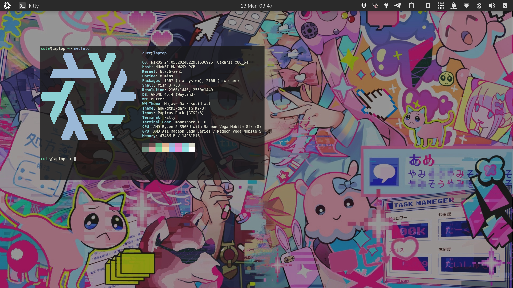

### My NixOS and home-manager configuration

### Note: this configuration is shared "as is", and i highly discourage blindly copy-pasting from it

---

Note: i'm paranoid, so agenix and some other secrets are outside from this repo in a private one. sorry :3

Also, i don't really like home-manager being outside of the scope of NixOS modules, so i ended up with including HM modules directly in NixOS modules.

### Desktop

- Gnome shell theme: `Mojave-Dark-solid-alt`
- Cursor theme: `Adwaita`
- Icons: `Papirus-Dark`
- Legacy applications (gtk3): `Adw-gtk3-dark`
- Firefox: [firefox colors theme](https://color.firefox.com/?theme=XQAAAAIcAQAAAAAAAABBKYhm849SCia3ftKEGccwS-xMDPr3mIJS1IAYgPpJmMqoaMV1vHo2YUqSSJyfqfEElOKeefz2PRijvIRDRLIzVMoSNIP805DV03v8JvcdcyT0427oa9ZjoN5H-wSBJomBI-gZyHGhmkB-wbsEkIjDeCMOoz9lf-QAUI6YkJ1vDRwGSSpJC4LwS-wWhw6i88zRfx5YLnkSgJ7JQ0XdiaN7p9mECRTcBSpPrC8AIx_TxFRxSLV-mf75sFj)

